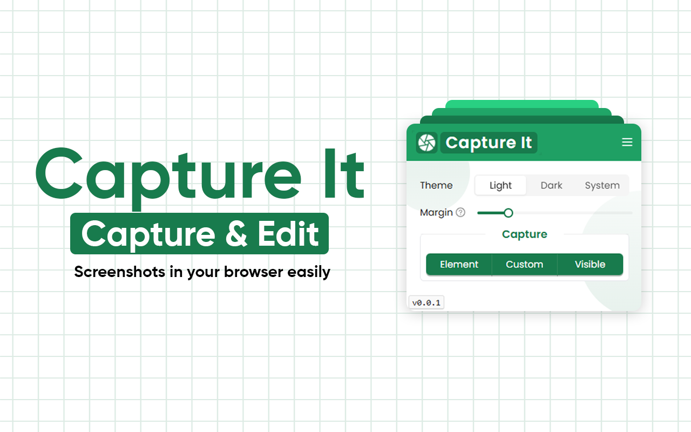
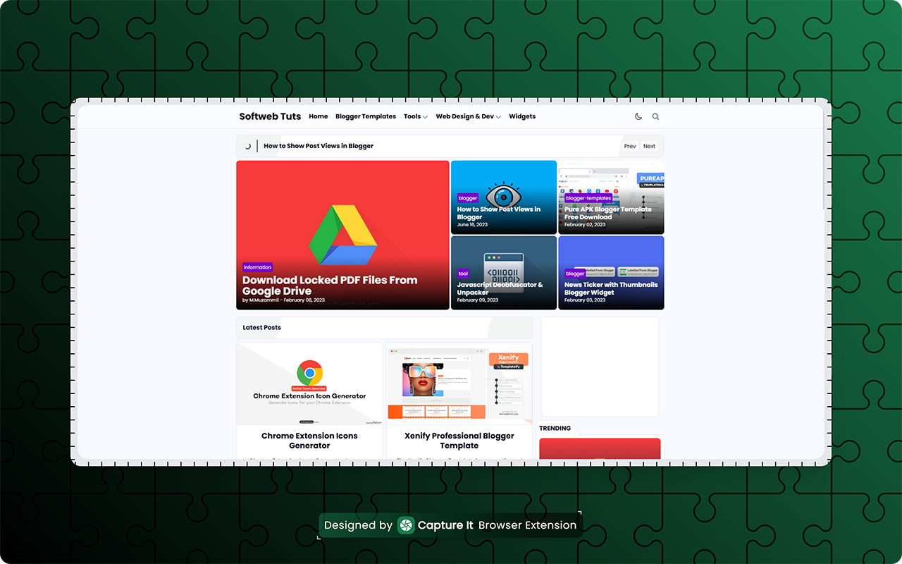
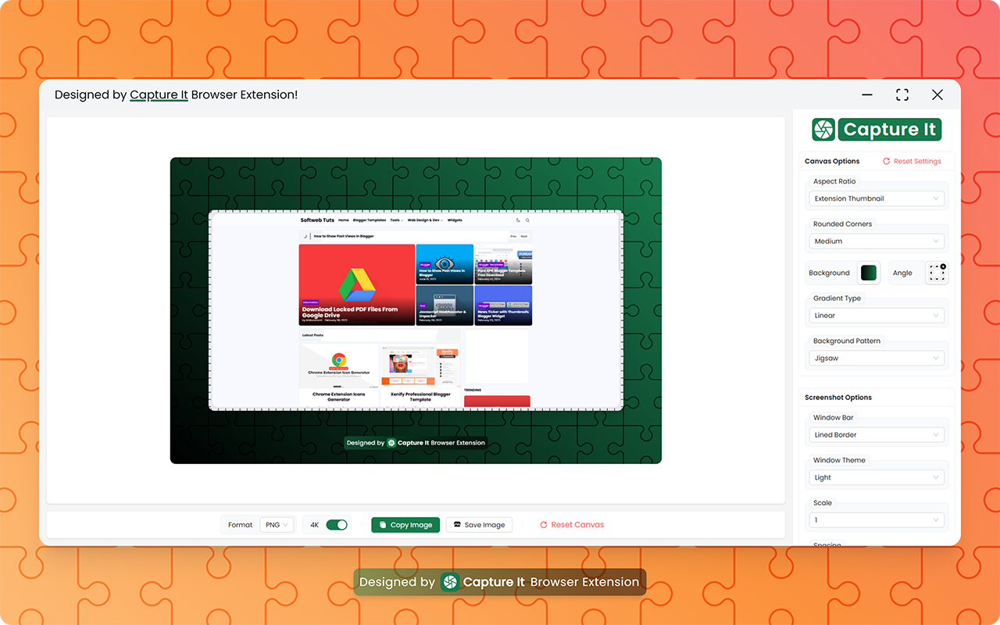

# Capture It - Capture & Edit Screenshots

Capture It! A browser extension to capture & edit screenshots in beautiful designs within your browser.
[Install Capture It - Capture & Edit Screenshots](https://chromewebstore.google.com/detail/capture-it-capture-edit-s/eglpfhbhmelampoihamjomgkeobgdofl)

---

---

Capture it is a lightweight, fast, and reliable tool for turning webpage elements and screenshots into high-quality images, in beautiful designs.

Unlike other screenshot tools that lose styling or fonts, Capture It guarantees what you see is exactly what you get — no distortion, no missing styles.

---

---

## 🔑 Key Features

✅ Pixel-perfect capture — preserves 100% of fonts, styles, and layout
🎨 Live padding & margin controls — adjust spacing with instant preview
🔲 Rounded corners — standard radius or smooth iOS-style
🖼️ Multiple export formats — PNG, JPG, WEBP, or SVG with quality control
🌗 Theme support — Light, Dark, or System (auto-detect)
🙈 Element hiding — temporarily hide distractions with a single key (H)
⚡ Fast workflow — hover to select element to capture
🎑 Image beautification — apply beautiful gradient backgrounds
✂️ Re-crop images for further editing
⌨️ Accessibility-friendly — fully usable with keyboard navigation
🔒 Privacy-first — all processing happens locally, no login required

---

---

## 🧭 How It Works

1️⃣ Click the extension icon and choose capture type
2️⃣ Hover to highlight the element you want or do selection
3️⃣ Save, Copy or Edit the captured screenshot in the editor

For support or any queries, email us!
